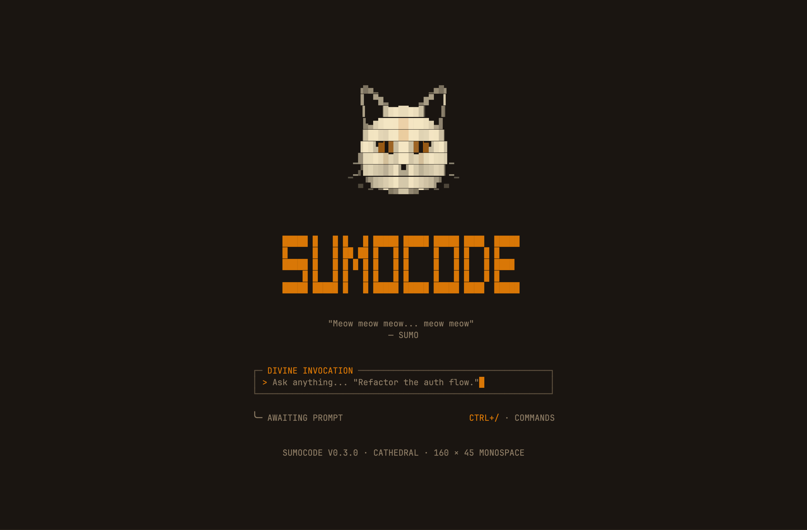
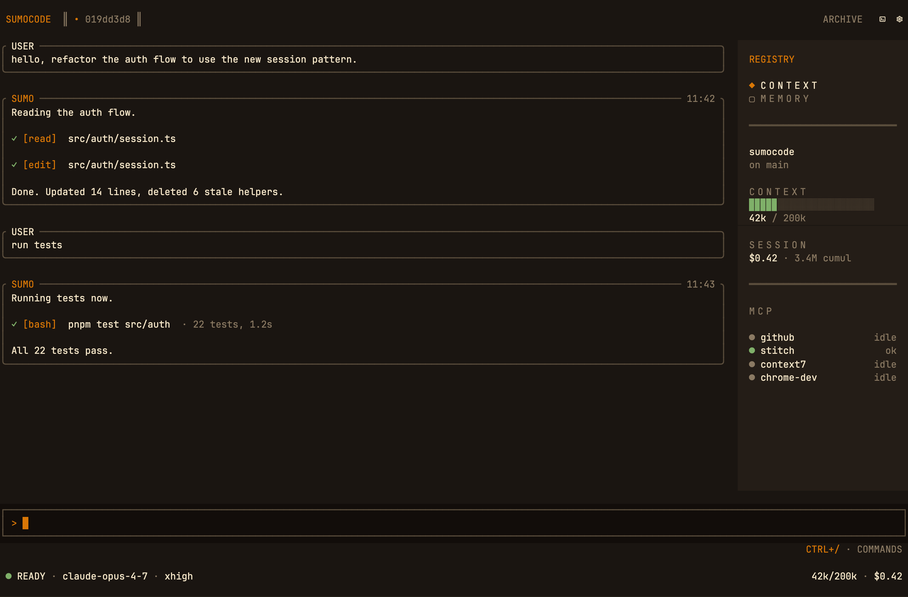
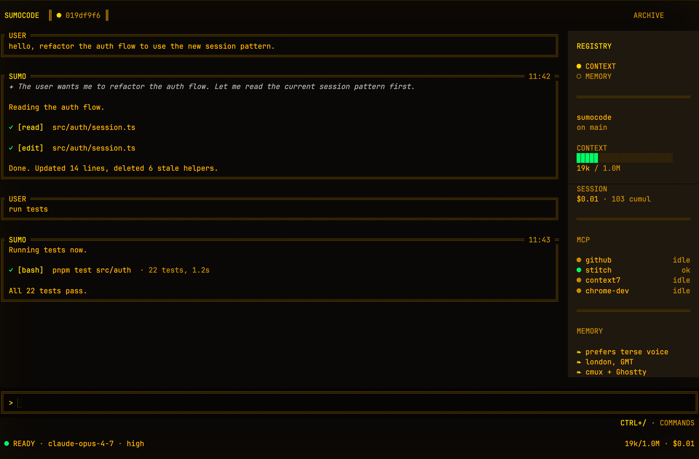
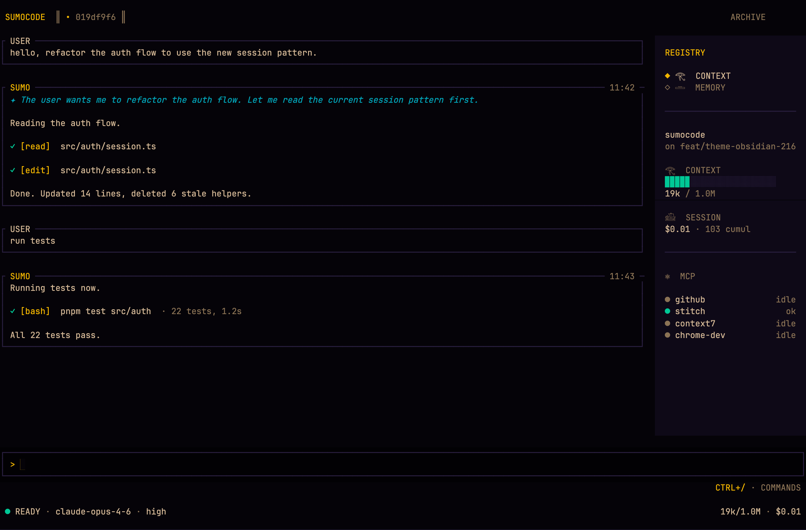

<div align="center">

# SumoCode

A Pi extension that ships its own retained terminal renderer (SumoTUI), four theme bundles, and a persistent memory surface. Daily-driven by the maintainer for two months.

[](./LICENSE)
[](./CHANGELOG.md)
[](https://github.com/earendil-works/pi)
[](./test)

<br>



</div>

---

## Overview

SumoCode is a [Pi](https://github.com/earendil-works/pi) extension. Pi provides the agent loop, LLM abstraction, sessions, MCP, and skills. SumoCode owns the experience layer: splash, top chrome, footer, sidebar, modals, themes, in-app scrollback, and mouse routing.

The renderer is **SumoTUI** — a Node-native retained renderer in [`src/sumo-tui/`](./src/sumo-tui/) — built around a Yoga flex layout tree, a cell compositor with frame diff, a modal layer, and a headless test backend. SumoTUI replaces Pi's line-concatenation `Container` for surfaces that require flex layout, in-app scroll, modal overlays, mouse routing, and signal-clean cleanup.

Four themes ship: Cathedral (default), Amber CRT, Obsidian Temple, and Herdr Terminal. Cycle with `Ctrl+Shift+T` (cathedral → amber-crt → obsidian → herdr); choice persists across machines.

## Theme tour

<table>
<tr>
<td align="center" width="33%">

<br><strong>Cathedral</strong>
<br><sub>Warm walnut chassis, burnt-orange accent, fleur-de-lis bullets, rounded chrome.</sub>
</td>
<td align="center" width="33%">

<br><strong>Amber CRT</strong>
<br><sub>Warm dark brown chassis, P3 amber phosphor, double-line ASCII chrome, P1 phosphor states.</sub>
</td>
<td align="center" width="33%">

<br><strong>Obsidian Temple</strong>
<br><sub>Deep obsidian background, electrum gold accent, neon cyan and magenta, Egyptian section glyphs.</sub>
<br><br><strong>Herdr Terminal</strong>
<br><sub>Near-black operational terminal, cyan routing accent, mint/gold/pink states, ASCII packet indicator.</sub>
</td>
</tr>
</table>

## Features

| Feature | Description |
|---|---|
| **Memory Scriptorium** | Persistent agent memory across six panels (identity, preferences, workflow, projects, system, general). Inline forget (`d`), search (`/`), retreat (`⎋`). Read-back on every new session. Open with `/sumo:memory`. |
| **Five preattentive states** | `idle`, `thinking`, `tool`, `approval`, `learning`. Each maps to a distinct theme-defined colour, surfaced in the footer dot and working indicator. |
| **Owned-shell mode** | Full altscreen ownership: retained renderer, in-app scroll, modal layer, mouse routing, OSC 52 cell-precise selection. Pi reduced to LLM, tools, sessions through adapters in [`src/sumo-tui/pi-compat/`](./src/sumo-tui/pi-compat/). |
| **`/sumo:reload`** | Hot-reload via launcher loop and exit code 100. Strips `--resume`, replaces with `--continue`. Resumes the in-flight session. |
| **`/fast`** | Session-local OpenAI/Codex fast-mode toggle. Wraps Pi's native `openai-responses` and `openai-codex-responses` streamers and passes `serviceTier: "priority"` through provider options instead of patching raw payloads. |
| **Cathedral approval modal** | Pattern-gated approval for dangerous bash commands. Default patterns cover `rm -rf`, `sudo`, `git push --force`, mutating `gh` calls. Configurable via `ApprovalGateConfig`. Modal height capped at 12 visible command rows. |
| **Sidebar** | Three sections at width ≥ 120: context (token meter, session cost), MCP (server roster), memory (persisted bullets). Hidden in portrait orientation per [`SUMO_TUI_PORTRAIT_SIDEBAR_POLICY.md`](./docs/SUMO_TUI_PORTRAIT_SIDEBAR_POLICY.md). |
| **Theme system** | Four first-party themes plus a chrome contract: each theme defines its own glyph set (`frame`, `sectionGlyphs`, `bullet`, `ruleChar`, `tabActive` / `tabInactive`) and an 8-frame working indicator. |
| **Diagnostics flight recorder** | `SUMO_TUI_DIAG_FILE=/path/file.jsonl` enables a 19-event-type structured trace covering runtime lifecycle, terminal state, upstream Pi events, owned-shell transitions, and module-load provenance. |

## In action

<div align="center">


</div>

A real working session, mid-flow. The user asks SUMO to refactor `src/auth/session.ts`. SUMO executes a `[read]` to understand the current pattern, an `[edit]` to apply the change, and a `[bash]` invocation to run the test suite — each tool call inline, framed in its parent SUMO message. The sidebar tracks the live context window (`42k / 200k`), session cost (`$0.42 · 3.4M cumul`), and MCP server roster on the right. Footer state dot reads `READY` (idle) on the active theme's idle phosphor. The same cell layout, glyph chrome, and state colours adapt to the active theme.

## Architecture

### SumoTUI

Pi's built-in TUI is a vertical line-concatenation `Container`. It does not provide flex layout, in-app scroll, mouse routing, or modal overlays. Workarounds — manual padding math for splash centering, footers floating wherever the linear renderer left them, mouse-wheel translating to arrow keys, kitty keyboard escapes leaking on signal exit — accumulated until they stopped scaling.

[**SumoTUI**](./src/sumo-tui/) replaces that path with a Node-native retained renderer that:

- Owns the altscreen lifecycle, mouse SGR routing, cursor state, and signal cleanup.
- Runs a Yoga flex layout tree (top chrome, chat row with sidebar, blank, input frame, hint, footer, bottom safe row).
- Composites cells through a frame diff that only repaints changed regions.
- Provides a modal layer that composites over the chat without losing focus.
- Wraps Pi's `CustomEditor` as a `PiEditorLeaf` so autocomplete, IME, kill-ring, undo-stack, and history continue to work.

Reasoning is documented in [ADR 0001](./docs/adr/0001-sumo-tui-framework.md).

### The runtime seam

SumoCode's interactive runtime is the foreground RPC host. `bin/sumocode.sh` launches `sumo-rpc-host.js` for interactive TTY sessions, and the host starts Pi in `--mode rpc` with the SumoCode extension loaded. Pi keeps the agent loop, LLM, sessions, MCP, skills, and provider/runtime machinery; SumoCode owns terminal rendering, editor input, chrome, overlays, transcript display, and retained state in the host process.

Non-interactive Pi behavior stays direct: `--print`, explicit `--mode`, non-TTY stdout, and the diagnostic `--no-sumo-tui` flag bypass the foreground host and execute Pi directly with `-e src/extension.ts`. The old private Pi constructor patch is retired; see [`docs/SUMO_TUI_PI_PATCH_STRATEGY.md`](./docs/SUMO_TUI_PI_PATCH_STRATEGY.md) for the historical note.

### Kernel contracts

Six contracts came out of the SumoTUI consolidation epic. Each is small, owns one responsibility, and is enforced by tests.

| Contract | Responsibility | Code | Doc |
|---|---|---|---|
| **TerminalSessionOwner** | Altscreen lifecycle, mouse and cursor reporting, signal cleanup, stdin and raw-mode handling. Split: terminal output ownership in `terminal-controller.ts`; stdin and raw-mode in `lifecycle.ts`. | [`src/sumo-tui/runtime/terminal-controller.ts`](./src/sumo-tui/runtime/terminal-controller.ts) + [`lifecycle.ts`](./src/sumo-tui/runtime/lifecycle.ts) | (in ADR + audit) |
| **InteractionRegistry** | Single registration point for keybindings, shortcuts, slash commands, with collision detection. Paired with a focus-aware key router. | [`src/interaction-registry.ts`](./src/interaction-registry.ts) + [`src/sumo-tui/input/key-router.ts`](./src/sumo-tui/input/key-router.ts) | (in ADR) |
| **Cancellable WorkerRuntime** | Background jobs that respect `Ctrl+C` and do not leak across session switches. | [`src/sumo-tui/runtime/worker-runtime.ts`](./src/sumo-tui/runtime/worker-runtime.ts) | (in ADR) |
| **Typed render primitives** | `Style`, `Span`, `Line` types for cell-correct rendering. Eliminates stale-style and cell-width bugs. | [`src/sumo-tui/render/primitives.ts`](./src/sumo-tui/render/primitives.ts) | [`SUMO_TUI_RENDER_PRIMITIVES.md`](./docs/SUMO_TUI_RENDER_PRIMITIVES.md) |
| **Headless TestBackend** | Test harness for retained-renderer behaviour without parsing real PTY bytes. | [`src/sumo-tui/testing/test-backend.ts`](./src/sumo-tui/testing/test-backend.ts) | [`SUMO_TUI_TEST_BACKEND.md`](./docs/SUMO_TUI_TEST_BACKEND.md) |
| **Structured TranscriptViewModel** | Typed `ChatBlock` taxonomy (markdown, code, tool, skill, question, delegation) replacing flattened message strings. | [`src/sumo-tui/transcript/view-model.ts`](./src/sumo-tui/transcript/view-model.ts) | [`SUMO_TUI_TRANSCRIPT_MODEL.md`](./docs/SUMO_TUI_TRANSCRIPT_MODEL.md) |

The **scriptorium modal chrome** ([`docs/cathedral/SCRIPTORIUM_CHROME.md`](./docs/cathedral/SCRIPTORIUM_CHROME.md)) is the shared lifted-bg overlay used by Divine Query, Approval, and Memory Scriptorium. It is the reason the three modals look like the same thing.

### Visual parity contract

Three rendering paths agree, cell for cell, against the same Bible mockups. [`docs/visual/parity/CONTRACT.md`](./docs/visual/parity/CONTRACT.md) defines the three lanes:

| Lane | Input | Purpose |
|---|---|---|
| `component` | Deterministic fixture → ANSI | Isolated TUI component captures. |
| `fixture` | `TranscriptViewModel` fixture → full-scene ANSI | Deterministic completed / tool / overlay states without live Pi. |
| `runtime` | `bin/sumocode.sh` via `node-pty` | Real end-to-end runtime captures. |

All three converge through `@xterm/headless` into a per-cell `{ char, fg, bg, bold, dim }` grid. Verification is **styled-cell diff** (text-level, deterministic) plus a **geometry audit** that classifies each row and bounds it against the spec. PNG diffs exist for human review packs but they are not the gate.

```bash
pnpm visual:ci
cat docs/visual/out/parity/<scenario>/raw/styled-cell-diff.txt
```

### Layout policy

Sidebar docks at terminal width ≥ 120. Below 120, the sidebar disappears and project / branch context moves into the hint row. Portrait — the canonical 60 × 100 viewport — has its own policy: no sidebar regardless of width. See [`SUMO_TUI_PORTRAIT_SIDEBAR_POLICY.md`](./docs/SUMO_TUI_PORTRAIT_SIDEBAR_POLICY.md).

### The bigger picture

```
┌──────────────────────────────────────────────────────────┐
│  Pi  ·  @earendil-works/pi-coding-agent@0.75.3           │
│   · LLM abstraction (pi-ai)                              │
│   · agent loop + tools (pi-agent-core)                   │
│   · sessions, compaction, auth, skills, MCP              │
│   · extension API (ctx.ui.*)                             │
└──────────────────────────────────────────────────────────┘
                          ▲
                          │ extension API + 36-line seam patch
                          ▼
┌──────────────────────────────────────────────────────────┐
│  SumoCode  ·  this repo                                  │
│   ┌─ src/sumo-tui/  retained renderer kernel ─────────┐  │
│   │  yoga flex layout · cell compositor · frame diff │  │
│   │  modal layer · mouse routing · OSC 52 selection   │  │
│   └─ headless TestBackend · typed render primitives ──┘  │
│   ┌─ src/themes/ Cathedral·AmberCRT·Obsidian·Herdr ───┐  │
│   │  palette + chrome glyphs + working indicator      │  │
│   └─ Ctrl+Shift+T to cycle, persisted via Pi ─────────┘  │
│   ┌─ src/cathedral/, src/memory-editor.ts, etc. ──────┐  │
│   │  Cathedral surfaces · Memory Scriptorium ·        │  │
│   └─ approval modal · Divine Query · skill pills ─────┘  │
└──────────────────────────────────────────────────────────┘
                          ▲
                          │ symlink into ~/.pi/agent/
                          ▼
┌──────────────────────────────────────────────────────────┐
│  sumocode-config  ·  private, synced across machines     │
│   · persona.md · memory · settings · MCP · extensions    │
└──────────────────────────────────────────────────────────┘
```

Design trail: [PRD](./docs/prd.md) · [ADR 0001](./docs/adr/0001-sumo-tui-framework.md) · [Pi patch strategy](./docs/SUMO_TUI_PI_PATCH_STRATEGY.md) · [render primitives contract](./docs/SUMO_TUI_RENDER_PRIMITIVES.md) · [transcript view-model](./docs/SUMO_TUI_TRANSCRIPT_MODEL.md) · [test backend](./docs/SUMO_TUI_TEST_BACKEND.md) · [scriptorium chrome](./docs/cathedral/SCRIPTORIUM_CHROME.md) · [visual parity contract](./docs/visual/parity/CONTRACT.md) · [V2 UX spec](./docs/ui/CATHEDRAL_UX_SPEC_V2.md) · [Pi tool architecture](./docs/PI_TOOL_ARCHITECTURE.md) · [portrait sidebar policy](./docs/SUMO_TUI_PORTRAIT_SIDEBAR_POLICY.md).

## Development

This is a personal Pi extension, not a clean drop-in. The patch is small and well-documented; the renderer is open for reading, forking, and lifting.

| Document | Purpose |
|---|---|
| [`DEV_LOOP.md`](./DEV_LOOP.md) | Edit / test / release workflow. |
| [`SETUP.md`](./SETUP.md) | What the maintainer runs on a new machine. |
| [`CHANGELOG.md`](./CHANGELOG.md) | Keep-a-Changelog format, retroactive for v0.1.0 → v0.2.0 → v0.3.0. |
| [`AGENTS.md`](./AGENTS.md) | Engineering conventions and AI-agent contract for this repo. |

The companion config lives at [`dhruvkelawala/sumocode-config`](https://github.com/dhruvkelawala/sumocode-config) and is private. Bring your own.

### Build and test

```bash
pnpm install                       # installs Pi peer deps + applies the patch
pnpm exec tsc --noEmit             # typecheck (no emit; Pi loads TS via jiti)
pnpm test                          # 807 unit tests
pnpm test:integration              # 32 integration tests via node-pty
pnpm visual:ci                     # V2 parity gate
pnpm dead-code                     # knip non-blocking dead-code scan
pnpm perf:startup                  # startup perf snapshot → docs/perf/startup.md
```

## Acknowledgements

[Mario Zechner](https://github.com/badlogicgames) and the [@earendil-works](https://github.com/earendil-works) team built [Pi](https://github.com/earendil-works/pi). Every cell SumoCode paints sits on top of Pi's agent loop, model registry, and extension API. The patch is 36 lines because Pi was already designed to be extended.

[OpenCode](https://opencode.ai/) provides the visual language SumoCode openly mirrors.

The renderer was built with significant assistance from frontier coding agents: Anthropic Claude Opus, OpenAI Codex, DeepSeek v4, and Kimi.

## License

MIT — see [LICENSE](./LICENSE).
