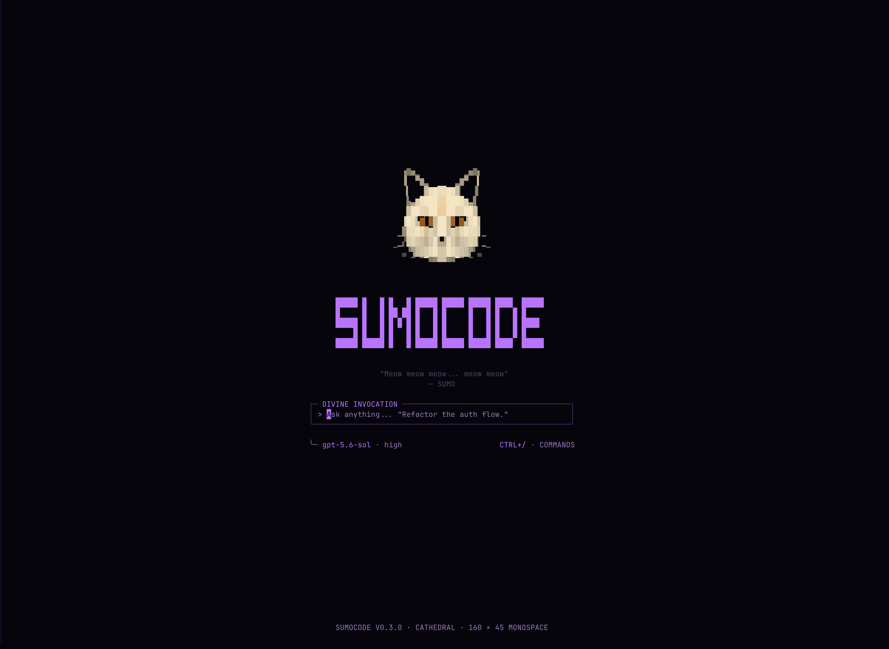

<div align="center">

# SumoCode

**A retained terminal shell for [Pi](https://github.com/earendil-works/pi).**<br>
SumoTUI owns the foreground experience; Pi runs behind it over RPC.

[](./LICENSE)
[](./CHANGELOG.md)
[](https://github.com/earendil-works/pi)
[](./package.json)

<br>



</div>

---

SumoCode is the terminal UX layer I daily-drive on top of Pi. Pi remains the agent runtime: it owns models, the agent loop, tools, sessions, MCP, skills, authentication, and provider integrations. SumoCode owns the screen around it: rendering, input, transcript presentation, overlays, themes, activity, orchestration surfaces, and terminal lifecycle.

The normal interactive path is now **RPC-first**. [`bin/sumocode.sh`](./bin/sumocode.sh) starts a foreground Node host, the host launches Pi with `--mode rpc`, and the two processes communicate over Pi's JSONL RPC protocol. SumoCode no longer depends on a private Pi constructor patch.

> [!NOTE]
> This is a personal, opinionated project rather than a polished general-purpose distribution. The code is public and MIT licensed; the maintainer's persona, memory, settings, MCP configuration, and skills live in a separate private repository.

## What ships

- **Retained SumoTUI shell** — Yoga layout, cell compositor, incremental frame diff, in-app scrollback, mouse routing, selection, modal layers, and signal-safe terminal cleanup.
- **Structured transcript** — Markdown, code, diffs, Mermaid, inline images, tool calls, skills, questions, background terminals, and delegated agents render as typed blocks instead of flattened strings.
- **Agent orchestration** — durable `terminal_*` jobs, headless and visible `subagent_*` delegation, role presets, bounded activity cards, cancellation, and isolated git worktrees.
- **Cathedral workflows** — command palette, Divine Query, Memory Scriptorium, approvals, model/session selectors, `/sumo:review`, `/sumo:worktree`, `/sumo:roles`, `/reload`, and `/fast`.
- **Five themes** — Cathedral, Amber CRT, Obsidian Temple, Herdr Terminal, and Ultraviolet Core. Each theme owns its palette, chrome, state colours, and working indicator.
- **Deterministic visual verification** — component, fixture, and real-runtime lanes converge on styled-cell diffs, geometry audits, and review screenshots.

## RPC-first architecture

```text
┌──────────────────────────── terminal ────────────────────────────┐
│                                                                  │
│  bin/sumocode.sh                                                 │
│          │                                                       │
│          ▼                                                       │
│  foreground SumoCode host                                       │
│  SumoTUI · editor · transcript · chrome · overlays · input      │
│          │                                                       │
│          │ Pi JSONL RPC over stdio                              │
│          ▼                                                       │
│  Pi child: pi --mode rpc -e src/extension-entry.ts              │
│  agent loop · providers · tools · sessions · MCP · skills       │
│                                                                  │
└──────────────────────────────────────────────────────────────────┘
```

The process boundary is intentional:

1. **SumoCode is the foreground client.** It owns the alternate screen, keyboard and mouse input, editor, retained state, and every painted cell.
2. **Pi is the execution engine.** It streams events and answers host requests through its supported RPC protocol.
3. **The extension uses an RPC-child profile.** It installs tools and compatibility commands needed by the host without starting a second terminal UI inside Pi.
4. **Direct Pi remains available.** Print mode, explicit `--mode`, non-TTY stdout, and `--no-sumo-tui` bypass the foreground host.

| Launch shape | Runtime path |
|---|---|
| `sumocode` / `sumocode .` in an interactive TTY | Foreground SumoCode host → Pi RPC child |
| `sumocode --print "..."` | Direct Pi |
| `sumocode --mode <mode>` | Direct Pi |
| stdout is not a TTY | Direct Pi |
| `sumocode --no-sumo-tui` | Direct Pi diagnostic bypass |

The runtime contract and historical migration notes live in [`docs/SUMO_TUI_PI_PATCH_STRATEGY.md`](./docs/SUMO_TUI_PI_PATCH_STRATEGY.md).

## Run it

### Prerequisites

- Node.js 22.19 or newer
- [`@earendil-works/pi-coding-agent`](https://github.com/earendil-works/pi)
- pnpm

### From a checkout

```bash
git clone https://github.com/dhruvkelawala/sumocode.git
cd sumocode
pnpm install
./bin/sumocode.sh
```

Open a particular project by passing its path:

```bash
./bin/sumocode.sh /path/to/project
```

For a global `sumocode` command while developing:

```bash
pnpm link --global
sumocode .
```

Pi can also install the repository as an extension package:

```bash
pi install git:github.com/dhruvkelawala/sumocode
```

The full RPC-first experience is launched through the `sumocode` wrapper; plain `pi` remains Pi's own entry point.

### Useful launcher commands

```bash
sumocode [path]                 # start the RPC-first interactive shell
sumocode -d [path]              # run with JSONL diagnostics enabled
sumocode doctor                 # check Pi, host, module, and diagnostics health
sumocode diag [file]            # summarize a diagnostics trace
sumocode -w feature-name        # create a worktree and open SumoCode there
sumocode task "prompt" [path]   # start directly in an agent turn
sumocode --no-sumo-tui          # bypass the RPC host for diagnosis
```

Run `sumocode --help` for the complete launcher contract and forwarded Pi options.

## Everyday controls

| Control | Action |
|---|---|
| `Ctrl+/` | Open the command palette |
| `Ctrl+Shift+T` | Cycle themes |
| `/sumo:memory` | Open persistent memory |
| `/sumo:roles` | Inspect and choose subagent roles |
| `/sumo:review` | Launch a tracked code-review agent |
| `/sumo:worktree` | Create or manage isolated worktrees |
| `/reload` | Restart the host and continue the current session |
| `/fast` | Toggle OpenAI/Codex priority service for this session |

## Themes and state

SumoCode exposes five preattentive agent states — `idle`, `thinking`, `tool`, `approval`, and `learning`. The active theme maps those states to its own colour and motion language while preserving the same semantic contract.

Theme order:

```text
Cathedral → Amber CRT → Obsidian Temple → Herdr Terminal → Ultraviolet Core
```

Ultraviolet Core can optionally use Fredy Sandoval's 0BSD RunCat glyphs. The safe orbital indicator remains the default.

```bash
pnpm runcat:install
pnpm runcat:check
```

Then map `U+E900–U+E904` to the installed `icomoon` font in the terminal and set `SUMOCODE_RUNCAT_FONT=1`. See the theme implementation and visual fixtures under [`src/themes/`](./src/themes/) and [`docs/ui/`](./docs/ui/).

## Repository map

| Path | Responsibility |
|---|---|
| [`bin/sumocode.sh`](./bin/sumocode.sh) | User-facing launcher, routing, diagnostics, task mode, and reload loop |
| [`sumo-rpc-host.js`](./sumo-rpc-host.js) | Stable host entry with bundle validation and source fallback |
| [`src/sumo-tui/rpc/`](./src/sumo-tui/rpc/) | Pi RPC client, host state, hydration, editor, controls, selectors, and overlays |
| [`src/sumo-tui/`](./src/sumo-tui/) | Retained renderer, layout, input, transcript, runtime, and test backend |
| [`src/activity/`](./src/activity/) | Shared live/durable activity contract and producer adapters |
| [`src/subagents/`](./src/subagents/) | Delegated-agent lifecycle, roles, tools, worktrees, and delivery |
| [`src/background-tasks/`](./src/background-tasks/) | Durable managed terminal processes and terminal tools |
| [`src/extension.ts`](./src/extension.ts) | Pi extension profiles, tools, commands, and compatibility bridge |
| [`docs/visual/parity/`](./docs/visual/parity/) | Visual contract, scenarios, evidence, and approved runtime goldens |

## Development

Pi executes TypeScript through jiti; there is no emitted application build required for the normal source loop. SumoCode also supports committed host and extension bundles with source fallback.

```bash
pnpm install
pnpm typecheck
pnpm test
pnpm test:integration
pnpm visual:ci
pnpm build
```

For local runtime work:

```bash
./bin/sumocode.sh -d .
sumocode diag
```

Before changing rendering primitives, read [`docs/SUMO_TUI_RENDER_PRIMITIVES.md`](./docs/SUMO_TUI_RENDER_PRIMITIVES.md). Before changing tools or interception, read [`docs/PI_TOOL_ARCHITECTURE.md`](./docs/PI_TOOL_ARCHITECTURE.md). The complete edit, test, and release workflow is in [`DEV_LOOP.md`](./DEV_LOOP.md).

## Design and architecture docs

- [ADR 0001 — SumoTUI framework](./docs/adr/0001-sumo-tui-framework.md)
- [RPC migration and patch strategy](./docs/SUMO_TUI_PI_PATCH_STRATEGY.md)
- [Transcript view-model contract](./docs/SUMO_TUI_TRANSCRIPT_MODEL.md)
- [Headless test backend](./docs/SUMO_TUI_TEST_BACKEND.md)
- [Visual parity contract](./docs/visual/parity/CONTRACT.md)
- [Cathedral UX specification](./docs/ui/CATHEDRAL_UX_SPEC_V2.md)

## Acknowledgements

[Mario Zechner](https://github.com/badlogicgames) and the [@earendil-works](https://github.com/earendil-works) team built [Pi](https://github.com/earendil-works/pi). SumoCode deliberately keeps Pi as the agent runtime and builds a different terminal experience around its public extension and RPC contracts.

[OpenCode](https://opencode.ai/) is an important influence on SumoCode's terminal interaction language.

The renderer and orchestration system were built with substantial assistance from frontier coding agents.

## License

MIT — see [LICENSE](./LICENSE).
