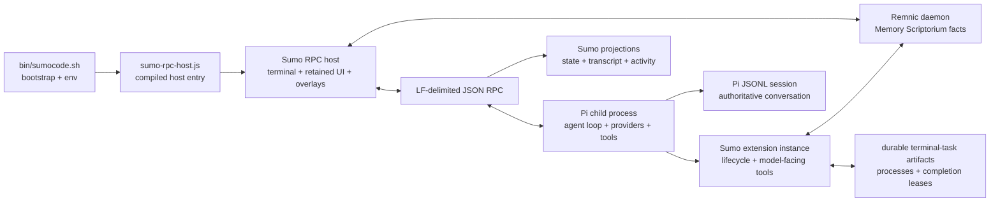

# SumoCode ↔ Prime Agent integration seams

**Status:** architecture research, not an implementation plan  
**Date:** 2026-08-06  
**SumoCode snapshot:** `9f70b8e` (`main`, working tree inspected locally)  
**Prime Agent snapshot:** [`PrimeIntellect-ai/prime-agent@0e0d233`](https://github.com/PrimeIntellect-ai/prime-agent/tree/0e0d23391bcd879f1aea70dbda4d07dda7970b34)

## Executive summary

SumoCode should import **ideas**, not Prime Agent's runtime.

SumoCode is currently a foreground, two-process application: the Sumo-owned RPC host owns the terminal, retained UI, host interactions, and projections; a child Pi process owns the authoritative agent loop, model/tool execution, and JSONL session. That boundary is now explicit and comparatively small. Replacing it with Prime's daemon, worker, kernel, scheduler, recursive-session, and messaging stack would move agent-loop ownership into SumoCode, recreate Pi's internals, and produce the fork this study is meant to avoid.

The feasible strategy is:

1. **Use Sumo-owned data planes for Sumo-owned capabilities.** Add supplemental goal/refinement state, host overlays, transcript cards, and configuration under narrow local interfaces. Do not rewrite Pi's base prompt or session file.
2. **Use Pi's public extension API for model-facing capabilities.** Custom tools, lifecycle hooks, supplemental context, custom session entries, and foreground process lifecycle are valid extension seams. Session replacement remains command-only and must respect Pi's fresh-context lifecycle.
3. **Ask upstream Pi for agent-runtime capabilities.** Retained recursive children, asynchronous parent/child messages, child registries that survive restore, child usage attribution, and detach/reattach all require the process that owns the agent loop. They cannot be made reliable by scraping JSONL or layering state in the foreground host.
4. **Reject Prime's daemon and Python control plane as imports.** Prime's implementation is a coherent replacement runtime, not a library boundary. Reuse its contracts and invariants where useful, not its supervisor, workers, Jupyter protocol, or Python shim.

The best first import is a **small, reversible continual-refinement ledger** that bridges SumoCode's Memory Scriptorium and Pi's supplemental context. The best second import is a **bounded goal/checkpoint controller while the foreground session is alive**. Both can ship without changing who owns the agent loop.

---

## 1. Sources, method, and classification rule

This report inspected SumoCode source, tests, architecture records, and the installed Pi extension documentation. Prime claims use the official Prime repository at the pinned commit above; no third-party summaries are used.

Each capability is classified into exactly one of these implementation classes:

- **Pure SumoCode** — achievable through current SumoCode modules plus Pi's existing public extension/RPC contracts, while leaving Pi as the agent-loop and session authority.
- **Requires upstream Pi API** — reliable implementation needs a new public capability in the process that owns the Pi agent/session runtime. SumoCode may add UI after that API exists, but should not emulate the runtime by reading files or patching private internals.
- **Reject** — importing the Prime implementation would duplicate or displace Pi runtime ownership, impose a second protocol/control plane, or create disproportionate security and maintenance cost. A smaller local concept may still be accepted separately.

“Pure SumoCode” does **not** mean “host-only.” It may include SumoCode's Pi extension code running in the child, so long as it uses public APIs and preserves ownership boundaries.

---

## 2. Current SumoCode architecture

### 2.1 Process and ownership map



The launcher resolves a local or installed package root, builds when necessary, and finally executes `sumo-rpc-host.js`; the host entry loads the compiled TypeScript host (`bin/sumocode.sh:L46-L120`, `sumo-rpc-host.js:L1-L44`). The host spawns Pi in RPC mode with `--no-extensions` followed by only SumoCode's extension entry, so the foreground composition is intentional rather than an incidental CLI wrapping (`src/sumo-tui/rpc/client.ts:L103-L124`).

The architectural ownership rule is explicit in code comments: Pi remains the source of truth for the agent/session, while Sumo's state store is only a render projection (`src/sumo-tui/rpc/state.ts:L1-L8`). The host owns terminal lifecycle and composition, then starts the RPC child, extension UI responder, state hydration, transcript pump, and event handlers (`src/sumo-tui/rpc/host.ts:L173-L221`, `src/sumo-tui/rpc/host.ts:L574-L645`).

**Consequence:** any imported feature that must execute a model turn, mutate the active context, compact, switch sessions, or account usage belongs first in Pi's child process. A host overlay can request or visualize it; it must not become a second agent runtime.

### 2.2 Foreground RPC host

The RPC client uses a single Pi child process with newline-delimited JSON request/response/event traffic. It correlates requests by ID, forwards asynchronous events, and terminates the child on stop (`src/sumo-tui/rpc/client.ts:L28-L99`, `src/sumo-tui/rpc/client.ts:L103-L170`). It has no supervisor, reconnect cursor, mutation journal, or detached worker identity.

Host startup hydrates `get_state`, resolves session metadata separately, builds transcript/activity projections, and buffers incoming session events while replacement-session hydration is in flight (`src/sumo-tui/rpc/host.ts:L574-L645`, `src/sumo-tui/rpc/host.ts:L680-L735`). The event barrier is important: adding more session-aware capability state must join the same replacement boundary rather than race it.

Host actions deliberately combine RPC controls with native Sumo overlays. The command catalog is a host-maintained list rather than a reflection of every child extension command (`src/sumo-tui/rpc/host-actions.ts:L133-L160`). The Memory Scriptorium is a concrete example of the preferred seam: `/sumo:memory` is handled by the host, which talks to the memory client and opens a retained Sumo overlay without asking Pi to serialize custom UI (`src/sumo-tui/rpc/host-actions.ts:L673-L678`, `src/sumo-tui/rpc/host-actions.ts:L1167-L1232`).

**Useful seam:** host actions and overlays are ideal for user control, review, rollback, and observability. They are not the place for hidden continuation loops.

### 2.3 Pi agent-loop ownership and extension constraints

SumoCode's extension factory registers lifecycle hooks, session cache, question/answer tools, background tasks, activity projection, and the subagent stack inside Pi (`src/extension.ts:L195-L238`). That makes it the correct insertion point for model-facing custom tools or supplemental prompt state.

Pi's installed public extension documentation permits custom tools, event interception/context injection, commands, and persistent custom session entries (`node_modules/@earendil-works/pi-coding-agent/docs/extensions.md:L3-L16`). It also documents a critical lifecycle constraint: session mutation methods are available only to command handlers because calls from event handlers can deadlock (`node_modules/@earendil-works/pi-coding-agent/docs/extensions.md:L1071-L1100`). On replacement, the old runtime is torn down, a new extension instance receives `session_start`, and captured session-bound objects become stale (`node_modules/@earendil-works/pi-coding-agent/docs/extensions.md:L1222-L1231`).

The Sumo RPC UI responder transports only a bounded set of serializable interaction methods—select, confirm, input/editor, notify, status, widget, title, and editor text—and explicitly rejects malformed/unsupported requests (`src/sumo-tui/rpc/extension-ui-responder.ts:L11-L37`, `src/sumo-tui/rpc/extension-ui-responder.ts:L64-L108`). Pi's extension docs likewise warn that some TUI-specific UI methods are no-ops or defaults in RPC mode (`node_modules/@earendil-works/pi-coding-agent/docs/extensions.md:L924-L938`). Arbitrary extension components therefore cannot be assumed to cross the RPC boundary.

There is also a legacy/general Pi-compat adapter that converts common extension UI calls into Sumo overlays and returns safe defaults for unsupported capabilities (`src/sumo-tui/pi-compat/extension-ui-adapter.ts:L17-L47`, `src/sumo-tui/pi-compat/extension-ui-adapter.ts:L49-L121`). It is a reusable contract reference, not permission to serialize arbitrary foreign UI.

**Constraint:** a new Prime-like model tool may be pure SumoCode, but its user-facing control surface should be a host-native command/overlay. Do not couple correctness to `ctx.ui.custom()` over RPC.

### 2.4 Session handling

Pi's session file remains authoritative. Because the current RPC state does not provide all session-list metadata, SumoCode has a local parser that locates the Pi agent directory, reads JSONL headers/messages, infers names, and lists session files (`src/sumo-tui/rpc/session-reader.ts:L1-L31`, `src/sumo-tui/rpc/session-reader.ts:L90-L145`, `src/sumo-tui/rpc/session-reader.ts:L147-L202`). This is acceptable for read-only presentation, but it is already a compatibility seam and should not be expanded into a second session writer.

Transcript hydration uses RPC `get_messages` when possible, falls back to the file reader for compatible data, then projects messages into Sumo view models (`src/sumo-tui/rpc/transcript-pump.ts:L38-L78`). Session replacement is performed through Pi RPC controls and then rehydrates host state rather than swapping local state optimistically (`src/sumo-tui/rpc/controls.ts:L128-L147`, `src/sumo-tui/rpc/host.ts:L680-L735`). An integration test asserts that `/new` stays in Sumo's altscreen while old-session content is removed (`test/integration/rpc-session-switch.test.ts:L32-L65`).

**Constraint:** supplemental Sumo artifacts must key themselves by Pi's stable session ID, update their active binding only after successful rehydration, and never append model messages directly to Pi JSONL from the host.

### 2.5 Transcript model

The transcript controller is a projection/reconciliation layer. It rebuilds from message snapshots, incrementally applies agent events, reconciles `agent_end`, folds tool activity by stable IDs, and preserves Sumo-specific status cards (`src/sumo-tui/transcript/controller.ts:L34-L91`, `src/sumo-tui/transcript/controller.ts:L147-L224`). The view-model converter maps Pi messages and custom messages into typed user, assistant, reasoning, activity, system, image, and error blocks (`src/sumo-tui/transcript/view-model.ts:L21-L52`, `src/sumo-tui/transcript/view-model.ts:L148-L222`).

Tests pin reconciliation behavior against Pi and cover duplicate-resistant activity folding, including subagent activity (`src/sumo-tui/transcript/controller.test.ts:L21-L60`, `src/sumo-tui/transcript/controller.test.ts:L201-L275`, `src/sumo-tui/transcript/controller.test.ts:L315-L356`).

**Useful seam:** goal checkpoints, refinement proposals/results, and child status can be presented as typed system/activity blocks or host overlays. The transcript projection should not become the durable capability ledger; it can be replayed and replaced.

### 2.6 Interaction registry

The interaction registry gives extension-side commands and shortcuts first-writer ownership, skips duplicates, and reports conflicts (`src/interaction-registry.ts:L41-L91`). Tests verify one registration per ID and show the centralized set of Sumo commands/shortcuts (`src/interaction-registry.test.ts:L15-L67`, `src/interaction-registry.test.ts:L69-L97`).

The foreground host nevertheless has its own command dispatch and static palette entries (`src/sumo-tui/rpc/host-actions.ts:L133-L160`, `src/sumo-tui/rpc/host-actions.ts:L639-L681`). This split is manageable but creates drift risk.

**Useful seam:** add user-facing Prime-like controls to the host registry/dispatcher; register child commands only when they must invoke Pi command-context APIs. Prefer a single shared declarative command descriptor if a feature needs both surfaces.

### 2.7 Worker and background-task runtimes

`CancellableWorkerRuntime` is an in-process promise coordinator with `AbortSignal`, job IDs, exclusive groups, stale-result suppression, and group cancellation (`src/sumo-tui/runtime/worker-runtime.ts:L1-L46`, `src/sumo-tui/runtime/worker-runtime.ts:L48-L106`). Its tests demonstrate cancellation semantics but no persistence or process isolation (`src/sumo-tui/runtime/worker-runtime.test.ts:L12-L84`). It is suitable for host-side analysis, indexing, proposal generation, and UI refresh work—not for an autonomous agent that must survive host exit.

SumoCode also has a much stronger terminal-task subsystem. Tasks have durable records, process identities, bounded logs, completion delivery state, and `passive`/`wake` policies (`src/background-tasks/task-types.ts:L5-L58`). Managers detach rather than stop durable children during session replacement, allowing a replacement extension instance to adopt them, but explicitly stop process-owned tasks when Pi quits (`src/background-tasks/background-task-tool.ts:L44-L76`). Wake completion is delivered as a follow-up only for the active owning session (`src/background-tasks/terminal-tools.ts:L162-L205`).

**Useful seam:** this is already the local equivalent of Prime's “long-running tool” behavior. Extend its presentation/contracts if needed; do not confuse durable subprocesses with a durable agent session.

### 2.8 Subagents

The manager owns Sumo subagent admission, bounded concurrency, status snapshots, cancellation, and update publication (`src/subagents/manager.ts:L83-L144`, `src/subagents/manager.ts:L146-L236`). The Pi backend launches a separate one-shot `pi --mode json --no-session --no-extensions` child and parses JSON events, so headless subagents are intentionally ephemeral and have no Sumo extension/runtime loaded (`src/subagents/backend-pi.ts:L315-L350`, `src/subagents/backend-pi.ts:L365-L444`).

The model-facing tools return after admission for asynchronous calls, expose list/wait/observe/stop operations, and can send follow-ups only when a visible pane backend supplies an input channel (`src/subagents/tools.ts:L50-L116`, `src/subagents/tools.ts:L153-L178`). Native task mode reinforces the boundary: it is direct-child-only, not recursively enabled, and its prompt states that only the primary agent coordinates subagents (`src/native-task-config.ts:L20-L40`).

**Constraint:** current Sumo subagents can support Prime-like visible admission/status UX, but not retained recursive descendants, durable child identity after restore, or universal parent/child messaging.

### 2.9 Memory Scriptorium

The memory client is an HTTP adapter to Remnic with query, add, browse, update, forget, and status operations (`src/memory.ts:L49-L111`, `src/memory.ts:L144-L247`). Memory extraction runs after `agent_end`, derives conversation text from Pi's branch, and asks the daemon to extract durable facts (`src/memory-extraction.ts:L77-L134`). The editor groups and manipulates those facts through Sumo-native UI, and the foreground host can invoke the same client directly (see §2.2).

This is semantically adjacent to Prime's continual harness, but it is not the same thing. Scriptorium facts are cross-session memory; Prime's harness also contains session-local prompt notes, executable skill descriptors, reusable subagent specs, refinement events, and rollback snapshots. Mixing those into Remnic facts would weaken type safety and scope semantics.

**Useful seam:** keep Scriptorium as a memory backend behind a new typed refinement ledger. A refinement may propose memory changes through the existing client, but prompt notes, skills, subagent specs, evidence, and rollback metadata should remain separate typed records.

### 2.10 Configuration

Sumo configuration is currently intentionally narrow: `primaryAgentName` and optional `themeName`, loaded in deterministic project → `.pi` project → global order and merged by recognized key (`src/config/sumocode-config.ts:L5-L21`, `src/config/sumocode-config.ts:L74-L117`). Saving patches preserves unrelated global keys and refuses malformed files rather than destroying them (`src/config/sumocode-config.ts:L120-L162`). Tests cover precedence, partial merges, malformed/unreadable inputs, and `PI_CODING_AGENT_DIR` isolation (`src/config/sumocode-config.test.ts:L16-L58`, `src/config/sumocode-config.test.ts:L75-L108`, `src/config/sumocode-config.test.ts:L151-L186`, `src/config/sumocode-config.test.ts:L189-L219`).

**Useful seam:** add one namespaced object such as `agentic.primeInspired`, validate every field, and preserve default-off behavior. Do not mirror Prime's full config schema.

---

## 3. What Prime Agent actually owns

Prime's architecture is useful precisely because it makes ownership explicit.

- Its `AgentSession` owns message delivery, token/context accounting, compaction, goals, scheduling, hooks, tools, IPython, and recursive descendants ([`architecture.md:L43-L49`](https://github.com/PrimeIntellect-ai/prime-agent/blob/0e0d23391bcd879f1aea70dbda4d07dda7970b34/packages/coding-agent/docs/architecture.md#L43-L49)).
- Its RLM design gives each session a persistent IPython kernel, but the TypeScript host—not Python—owns child execution, persistence, accounting, and lifecycle ([`rlm-runtime.md:L1-L4`](https://github.com/PrimeIntellect-ai/prime-agent/blob/0e0d23391bcd879f1aea70dbda4d07dda7970b34/packages/coding-agent/docs/rlm-runtime.md#L1-L4), [`L62-L72`](https://github.com/PrimeIntellect-ai/prime-agent/blob/0e0d23391bcd879f1aea70dbda4d07dda7970b34/packages/coding-agent/docs/rlm-runtime.md#L62-L72)). Delegation returns an admission handle immediately; results arrive later through explicit messages or files ([`L23-L32`](https://github.com/PrimeIntellect-ai/prime-agent/blob/0e0d23391bcd879f1aea70dbda4d07dda7970b34/packages/coding-agent/docs/rlm-runtime.md#L23-L32)).
- Recursive children are real `AgentSession` instances with inherited runtime facilities, depth policy, persistent registries, and usage attribution ([`rlm-runtime.md:L158-L205`](https://github.com/PrimeIntellect-ai/prime-agent/blob/0e0d23391bcd879f1aea70dbda4d07dda7970b34/packages/coding-agent/docs/rlm-runtime.md#L158-L205)).
- The continual harness is supplemental persisted state—not a second engine—and `/refine` applies small create/update/delete edits with rollback while keeping the base prompt immutable ([`rlm-runtime.md:L207-L225`](https://github.com/PrimeIntellect-ai/prime-agent/blob/0e0d23391bcd879f1aea70dbda4d07dda7970b34/packages/coding-agent/docs/rlm-runtime.md#L207-L225)). The implementation models prompt, memory, skill, and subagent entries plus refinement evidence/events ([`refinement.ts:L21-L63`](https://github.com/PrimeIntellect-ai/prime-agent/blob/0e0d23391bcd879f1aea70dbda4d07dda7970b34/packages/coding-agent/src/core/refinement/refinement.ts#L21-L63)).
- Detach/reattach is not a TUI trick. Prime runs a supervisor plus one worker per root tree; the worker owns the session, scheduler, kernels, and descendants, while clients attach and detach ([`daemon.md:L23-L38`](https://github.com/PrimeIntellect-ai/prime-agent/blob/0e0d23391bcd879f1aea70dbda4d07dda7970b34/packages/coding-agent/docs/daemon.md#L23-L38)). The protocol includes identities, cursors, snapshots, backpressure, command journals, and crash semantics ([`daemon.md:L76-L103`](https://github.com/PrimeIntellect-ai/prime-agent/blob/0e0d23391bcd879f1aea70dbda4d07dda7970b34/packages/coding-agent/docs/daemon.md#L76-L103), [`L133-L142`](https://github.com/PrimeIntellect-ai/prime-agent/blob/0e0d23391bcd879f1aea70dbda4d07dda7970b34/packages/coding-agent/docs/daemon.md#L133-L142)).
- Scheduling belongs to each worker and has durable claim-before-delivery semantics to avoid replaying uncertain prompts after crashes ([`daemon.md:L68-L74`](https://github.com/PrimeIntellect-ai/prime-agent/blob/0e0d23391bcd879f1aea70dbda4d07dda7970b34/packages/coding-agent/docs/daemon.md#L68-L74)).
- IPython is explicitly **not** a sandbox; model-generated Python runs with worker OS permissions ([`rlm-runtime.md:L249-L253`](https://github.com/PrimeIntellect-ai/prime-agent/blob/0e0d23391bcd879f1aea70dbda4d07dda7970b34/packages/coding-agent/docs/rlm-runtime.md#L249-L253)).

These are coherent systems. Copying only the visible API while omitting ownership, accounting, leases, recovery, and trust semantics would produce a misleading and unsafe imitation.

---

## 4. Capability classification

| Prime-like capability | Classification | Feasible Sumo seam | Boundary / rationale |
|---|---|---|---|
| Typed continual-refinement ledger: prompt notes, memory proposals, skill/subagent descriptors, evidence, rollback | **Pure SumoCode** | New `src/refinement/` domain/store; host `/sumo:refine` overlay; extension `before_agent_start` supplemental context; Scriptorium adapter | Pi already permits context injection/custom entries. Keep base prompt immutable, default local scope, and explicit apply/rollback. |
| Scriptorium-backed memory edits proposed by refinement | **Pure SumoCode** | Existing `RemnicMemoryClient`; `CancellableWorkerRuntime` for proposal/review; host memory UI | Apply only explicit, typed memory edits. Do not turn every trajectory note into a global fact. |
| Auto-refine review at bounded checkpoints (`agent_end`, pre/post compaction) | **Pure SumoCode** | Extension lifecycle hooks; worker runtime; persisted review cursor | Run only when idle, serialize per session, cap input/output, default to proposal-only. Never invoke command-only session replacement from an event hook. |
| Session-local goal record, token/wall-clock budget display, checkpoint/complete commands | **Pure SumoCode** | Typed session artifact keyed by Pi session ID; host action/overlay; sidebar/activity projection | Goal metadata and UI are local. Continuations may be requested only through public Pi message/command APIs while the child is alive. |
| Unattended goal continuation that survives closing SumoCode | **Requires upstream Pi API** | Future Pi resident-session/continuation API; Sumo host becomes attachable client | Foreground RPC child currently dies with the host. A Sumo timer cannot own or revive Pi's agent loop safely. |
| Persistent IPython tool for one live foreground session | **Pure SumoCode (opt-in)** | Sumo extension custom tool; child-owned kernel manager; cleanup on `session_shutdown`; optional namespace snapshot in Sumo artifact | Technically possible without changing the loop, but high security/dependency cost. Keep optional and non-recursive. |
| Kernel that survives detach/restart and acts as the RLM host bridge | **Reject** | None in SumoCode | This imports Prime's worker/kernel control plane. Without a resident Pi runtime, snapshot/revival and host requests are incomplete; with one, Sumo has replaced Pi ownership. |
| Asynchronous subagent admission + existing list/wait/observe/stop | **Pure SumoCode (already present)** | `src/subagents/manager.ts`, tools, activity/transcript projection | Improve handles and UI, but retain current direct-child policy and explicit completion observation. |
| Retained child sessions, recursive descendants, stable registry after parent restore | **Requires upstream Pi API** | Future Pi child-session API consumed by Sumo manager/projectors | Must share Pi providers, hooks, compaction, credentials, accounting, and session lifecycle. Current one-shot JSON child cannot supply this. |
| Universal parent↔child messaging and follow-up by stable child ID | **Requires upstream Pi API** | Future Pi agent-message transport; Sumo UI can expose it | Current follow-up works only for visible-pane backends with an input channel. Polling JSONL or writing stdin to one-shot children is not a durable transport. |
| Child usage/cost attribution into the launching parent turn | **Requires upstream Pi API** | Future Pi event/session-entry contract; transcript view can render it | Sumo does not own provider accounting or parent message mutation. Host-side estimates would be non-authoritative. |
| Direct-child observation/context tree for current Sumo agents | **Pure SumoCode** | Existing manager snapshots, manifests, activity feed, transcript cards | Present only facts Sumo currently owns: state, output tail, manifest, elapsed time. Do not imply recursive or restored lineage. |
| Durable external terminal tasks with passive/wake completion | **Pure SumoCode (already present)** | Existing terminal-task manager/store/tools | This is Sumo's strongest Prime-adjacent capability. Harden/adapt it rather than introduce Prime scheduling for subprocesses. |
| Cron/heartbeat prompts while the foreground Pi child remains alive | **Pure SumoCode, narrowly** | Extension-side timer + session-bound persisted job record + public `sendMessage`/follow-up; host overlay | Suitable only for explicit, bounded, foreground jobs. Must pause when busy and bind delivery to active session ID. |
| Schedules that run across host exit/crash or target inactive sessions | **Requires upstream Pi API** | Future Pi scheduler/resident-session API | Correct behavior needs leases, claim-before-delivery, active-session ownership, crash semantics, and a process that owns the loop. |
| Prime daemon/supervisor, local protocol, worker adoption, reconnect journal | **Reject** | Keep Sumo's existing Pi RPC child | This is a replacement runtime with a large protocol and recovery surface. Importing it would make Sumo a Prime/Pi hybrid fork. |
| Prime Python `rlm` shim and Jupyter `host.request` protocol | **Reject** | If needed, expose TypeScript tools directly through Pi extension API | It exists to bridge Python into Prime's own `AgentSession`. Sumo lacks that host and gains no value from duplicating the bridge. |
| Prime base prompt/tool vocabulary wholesale | **Reject** | Translate only small UX concepts into Sumo's language | It would erase Sumo's product identity and bind behavior to runtime features Sumo does not own. |
| Prime's typed contracts/invariants as design references | **Pure SumoCode** | Local TypeScript domain types and tests | Admission handles, explicit scope, durable IDs, rollback snapshots, depth limits, and claim-before-delivery are patterns, not dependencies. |

### Classification nuance

The “foreground IPython” and “foreground heartbeat” rows are feasible in the strict architectural sense, not automatically recommended. They should ship only after threat modeling and explicit opt-in. Their durable Prime variants are intentionally classified differently because persistence changes runtime ownership.

---

## 5. Recommended seams and minimal patch surface

### Seam A — continual refinement without a second memory system

Create a small domain module rather than cloning Prime's harness implementation:

```text
src/refinement/
  domain.ts          # RefinementEntry, Proposal, AppliedEdit, Scope, schema version
  store.ts           # atomic local JSON; session/global namespaces; rollback snapshots
  context.ts         # bounded supplemental prompt rendering
  memory-adapter.ts  # explicit mapping of memory edits to RemnicMemoryClient
  review.ts          # proposal generation; no direct source-file mutation
  install.ts         # Pi lifecycle/tool/command registration
```

Minimal integration points:

- `src/extension.ts`: install the extension-side context/review hooks.
- `src/sumo-tui/rpc/host-actions.ts`: `/sumo:refine`, review, apply, rollback.
- `src/config/sumocode-config.ts`: namespaced, default-off configuration.
- `src/sumo-tui/transcript/view-model.ts` only if durable refinement results are emitted as Pi custom messages; otherwise keep them in a host overlay/activity card.
- `src/memory.ts`: no schema change; consume it through an adapter.

Recommended invariants adapted from Prime:

1. Base system prompt is immutable; refinements are supplemental.
2. Default scope is the current session; global scope is explicit.
3. Proposals contain typed create/update/delete edits plus evidence and expected outcome.
4. Applying edits records before/after snapshots; rollback is a first-class operation.
5. Proposal generation cannot edit source files, install packages, or mutate memory directly.
6. Context rendering is bounded and deterministic.
7. Corrupt supplemental state degrades visibly and does not prevent Pi startup.

Do **not** write this state into Pi JSONL from the host. If transcript persistence is desirable, append a small custom entry through the extension API in the child, while the full ledger stays in Sumo-owned artifacts.

### Seam B — bounded goals and checkpoint continuation

Add a `GoalController` interface whose implementation is explicitly foreground-scoped:

```ts
interface GoalController {
  get(sessionId: string): GoalSnapshot | undefined;
  create(sessionId: string, input: GoalInput): GoalSnapshot;
  checkpoint(sessionId: string, evidence: GoalCheckpoint): GoalSnapshot;
  complete(sessionId: string, summary: string): GoalSnapshot;
  cancel(sessionId: string, reason: string): GoalSnapshot;
}
```

The host owns goal editing and presentation. The child extension owns any model-facing `goal_get/checkpoint/complete` tools and continuation request because only Pi knows whether it is idle and how messages are queued. Persist counters and checkpoint evidence under a Sumo session-artifact directory keyed by Pi session ID.

Hard limits:

- default disabled;
- explicit wall-clock, turn, and token budgets;
- no restart/detach guarantee;
- at most one queued continuation;
- pause on UI interaction or pending messages;
- no continuation after session replacement until the new session ID is rehydrated;
- visible stop control and visible checkpoint transcript/activity events.

### Seam C — normalize asynchronous work handles

Sumo already has three related handle/state models: cancellable host workers, durable terminal tasks, and Sumo subagents. Define a small read-only `AsyncWorkSnapshot` projection rather than unifying their execution runtimes:

```ts
type AsyncWorkKind = "host-worker" | "terminal" | "subagent" | "refinement";
type AsyncWorkSnapshot = {
  id: string;
  ownerSessionId: string;
  kind: AsyncWorkKind;
  title: string;
  status: "queued" | "running" | "succeeded" | "failed" | "cancelled" | "lost";
  createdAt: number;
  updatedAt: number;
  parentId?: string;
  outputTail?: string;
};
```

Project this into the existing activity/transcript model. Keep cancellation and persistence delegated to each existing owner. This imports Prime's admission-handle and observability discipline without importing its recursive runtime.

### Seam D — upstream Pi capability requests

Before implementing retained recursive agents locally, propose narrowly scoped upstream contracts:

1. **Child session API:** spawn a child with inherited model/runtime options and return a stable admission handle.
2. **Agent message API:** send to parent/child by stable ID, with delivery events and cancellation semantics.
3. **Child registry:** enumerate direct children from the authoritative parent session after compaction/restore.
4. **Usage attribution event/entry:** expose authoritative child usage linked to the launching parent assistant message.
5. **Resident/attachable RPC lifecycle or externally supervised session API:** only if detach/reattach becomes a real product requirement.
6. **Session list/metadata RPC:** replace Sumo's read-only JSONL parsing with a public query before adding richer session artifacts.

Each request should be useful to Pi independently of SumoCode. Sumo should consume it through a local adapter so unsupported Pi versions degrade cleanly.

---

## 6. Staged integration sketch

### Stage 0 — contracts and guardrails (small, no behavior change)

**Patch surface:** new domain types/tests; one optional config object.

- Define `RefinementStore`, `GoalController`, and `AsyncWorkSnapshot` interfaces.
- Add a versioned session-artifact path resolver keyed by Pi session ID.
- Extend config with one default-off namespaced block.
- Add golden tests for scope, atomic writes, corruption handling, rollback, and session replacement binding.

**Exit gate:** no model calls, no new background process, no transcript mutation, full current unit suite remains green.

### Stage 1 — manual refinement proposal/review

**Patch surface:** `src/refinement/*`, `src/extension.ts`, host action/overlay, config/tests.

- Add `/sumo:refine review` to generate a proposal from a bounded trajectory slice.
- Show create/update/delete edits and evidence in a host-native overlay.
- Require explicit apply; support immediate rollback.
- Route only memory-kind edits through `RemnicMemoryClient`; keep other kinds in typed Sumo storage.
- Inject a bounded, read-only refinement overview in `before_agent_start`.

**Exit gate:** replacement sessions cannot see each other's local state; global changes require explicit confirmation; corrupt state does not break startup; no arbitrary UI crosses RPC.

### Stage 2 — checkpoint automation and unified observability

**Patch surface:** extension lifecycle hook, worker runtime, activity projector/view model.

- Add default-off auto-review at an interval or compaction checkpoint.
- Use `CancellableWorkerRuntime` with one exclusive group per session to suppress stale review results.
- Emit visible activity states and applied/rolled-back results.
- Project existing terminal tasks, subagents, and refinement jobs through `AsyncWorkSnapshot` without merging execution code.

**Exit gate:** auto-review never applies edits by default, never overlaps itself, cancels on session switch, and has bounded context/cost.

### Stage 3 — foreground goals

**Patch surface:** goal store/controller, host command/overlay/sidebar, child extension tools.

- Add explicit goal create/checkpoint/complete/cancel.
- Implement bounded continuation only while the foreground Pi child is attached and idle.
- Record why each continuation was queued or suppressed.
- Reuse existing transcript/activity components for visibility.

**Exit gate:** stop is immediate, there is no continuation after host exit, budgets are enforced after restore, and replacement-session hydration is race-free.

### Stage 4 — optional foreground IPython experiment

**Patch surface:** isolated extension tool and kernel manager package; no host/runtime changes.

- Feature-flag it for trusted workspaces only.
- Lazy-start one kernel in the Pi child.
- Serialize execution, bound output, propagate abort, and kill on session shutdown.
- Do not expose recursive spawn or provider credentials to Python.
- Treat namespace persistence as experimental data export, not process continuity.

**Exit gate:** threat model accepted; dependencies and cold-start/RSS measured; shutdown leaves no child; the model cannot mistake the kernel for a sandbox.

This stage is optional and should be skipped unless Python-state continuity solves an observed SumoCode problem.

### Stage 5 — consume upstream Pi APIs, if they land

- Add capability negotiation in the Sumo adapter.
- Replace ephemeral headless children only for supported Pi versions.
- Preserve current Sumo subagent backend as fallback.
- Add retained child registry/messaging/usage UI without changing Sumo host ownership.

**Exit gate:** zero private Pi patches; old Pi versions fail closed or use existing behavior; authoritative IDs/accounting come from Pi.

### Explicit non-stage — do not build a Sumo daemon

There should be no later “stage” that imports Prime's supervisor, resident workers, Jupyter host bridge, or protocol v4. If durable agent detach/reattach becomes essential and Pi declines the needed API, that is a product-level decision to replace Pi—not an incremental Prime integration.

---

## 7. Open risks and required mitigations

| Risk | Why it matters here | Mitigation / test |
|---|---|---|
| **Split ownership drift** | Host command list and child interaction registry are separate. | Shared descriptors for dual-surface commands; tests that host and extension aliases agree. |
| **Session replacement races** | Pi rebuilds the extension instance; host buffers events and rehydrates asynchronously. | Bind by authoritative session ID; cancel host workers; hydrate supplemental state inside the existing barrier; never reuse old extension context. |
| **Private session-format coupling** | Sumo already parses Pi JSONL for list/hydration fallback. | Keep reads presentation-only; request session-list RPC upstream; schema fixtures pinned to Pi versions. |
| **Memory scope pollution** | Scriptorium facts are durable/cross-session; refinement notes are often local. | Typed scopes; proposal-only global changes; explicit adapter; no implicit auto-global writes. |
| **Autonomous feedback loops** | Auto-refine plus goal continuation can create self-reinforcing prompt state. | Default off; separate review from apply; turn/cost limits; evidence; rollback; visible events. |
| **Double prompting** | Background task wake, goal continuation, and queued user messages can race. | One session-scoped arbiter in the child using Pi idle/pending-message APIs; idempotency key per checkpoint. |
| **Worker misinterpretation** | `CancellableWorkerRuntime` sounds durable but is process-local. | Name APIs clearly; never promise restart survival; use terminal-task store only for actual subprocess durability. |
| **Orphaned kernels/processes** | A foreground IPython experiment adds executable children. | Lazy start, process-tree identity, abort/kill tests, shutdown hooks, and startup orphan scan before enabling snapshots. |
| **Python trust boundary** | Model-generated Python has user permissions. | Trusted-workspace gate, explicit warning, disabled by default, optional external sandbox; never call it isolation. |
| **Cost/accounting inaccuracy** | Sumo cannot authoritatively fold child cost into Pi turns. | Do not estimate as authoritative; wait for Pi usage events/API. |
| **Recursive explosion** | Current Sumo policy is direct-child-only; Prime can configure deeper trees. | Retain depth 1 unless Pi supplies authoritative depth/registry controls; hard admission/concurrency budgets. |
| **Pi API/version drift** | Current installed APIs already move across versions. | Capability adapter, public APIs only, pinned contract fixtures, monthly compatibility smoke test. |
| **Transcript/UI conflated with storage** | Projection replacement can remove transient cards. | Durable state in typed stores or Pi custom entries; transcript only visualizes. |
| **Current type baseline is not green** | Architectural work could hide unrelated dependency/API drift. | Fix or baseline existing compiler failures before implementation; require both unit and type checks for each stage. |

### Current verification baseline

At the inspected snapshot:

- `pnpm test` passed **174 files / 2,152 tests**.
- `pnpm exec tsc --noEmit` failed on pre-existing Pi API/type drift in `login-command.ts` and the local `get_available_thinking_levels` RPC typing. This report did not modify those files. The unit suite is strong, but Stage 0 should restore a green type baseline before new capability code is accepted.

The most relevant existing test seams are RPC session hydration/host behavior (`src/sumo-tui/rpc/host.test.ts:L101-L170`), transcript reconciliation (`src/sumo-tui/transcript/controller.test.ts:L21-L60`), worker cancellation (`src/sumo-tui/runtime/worker-runtime.test.ts:L12-L84`), interaction collision handling (`src/interaction-registry.test.ts:L15-L67`), configuration precedence/safety (`src/config/sumocode-config.test.ts:L16-L58`, `src/config/sumocode-config.test.ts:L151-L186`), and Scriptorium HTTP behavior (`src/memory.test.ts:L31-L85`).

---

## 8. Decision summary

### Build in SumoCode now

- typed, reversible continual-refinement state;
- explicit Scriptorium memory adapter;
- bounded manual/automatic review;
- session-local goal/checkpoint UI and foreground-only continuation;
- unified read-only asynchronous-work projection;
- improved admission handles and direct-child observability;
- narrow, namespaced, default-off configuration.

### Ask Pi upstream for

- authoritative retained child sessions and direct-child registry;
- parent/child messaging by stable ID;
- child usage attribution;
- resident/attachable session lifecycle if durability becomes essential;
- richer session list/metadata RPC.

### Reject as imports

- Prime's daemon/supervisor/worker topology;
- Prime's local protocol, recovery journal, and scheduler implementation;
- Prime's Jupyter `host.request` and Python RLM shim;
- a parallel agent/session writer in the Sumo host;
- direct Pi JSONL mutation;
- wholesale Prime prompts, tool vocabulary, or Python skill ecosystem.

## Final recommendation

Ship **Stage 0 + Stage 1** first. They capture Prime's highest-value idea—small, evidence-backed, reversible improvements outside token history—while fitting SumoCode's strongest existing seams: host-native overlays, Pi lifecycle/context hooks, Memory Scriptorium, cancellable workers, transcript/activity projection, and deterministic config.

Treat goals as a second, foreground-only experiment. Defer kernels unless user evidence justifies their trust and maintenance cost. Put recursive persistence, durable messaging, usage attribution, and detach/reattach behind upstream Pi capability requests. That preserves the most important architectural invariant in SumoCode today: **Sumo owns the experience; Pi owns the agent loop.**
